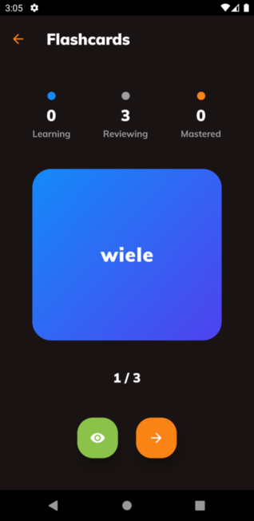
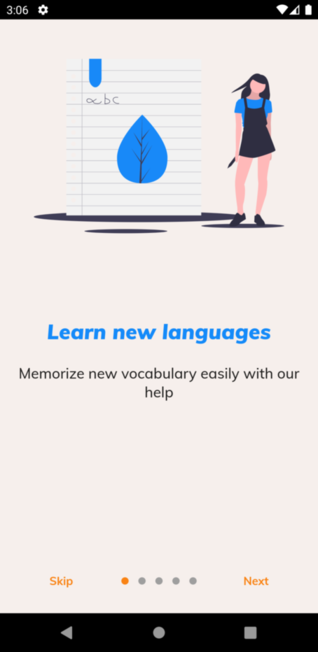
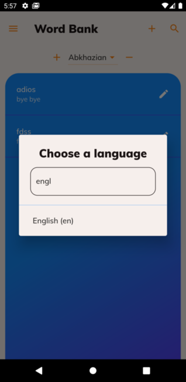
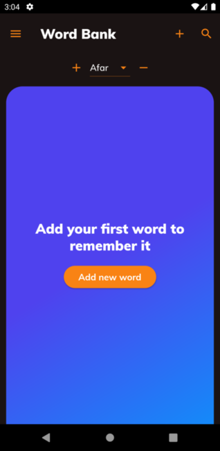
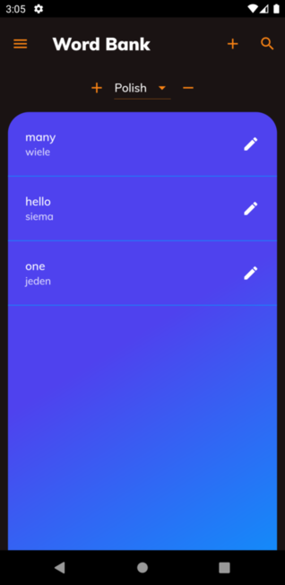

# Easy Language

## An application that will help you learn new languages!
## Made using Flutter framework
## Stack

It uses flutter beta, nestjs backend, and provider.
Riverpod and flutter hooks are to be used in the future.

### Connected to backend: [easy-language-backend](https://github.com/adam-podkowinski/easy-language-backend)

### Trello board: [Easy Language](https://trello.com/b/V8EUc7b3/easy-language)

 
 
